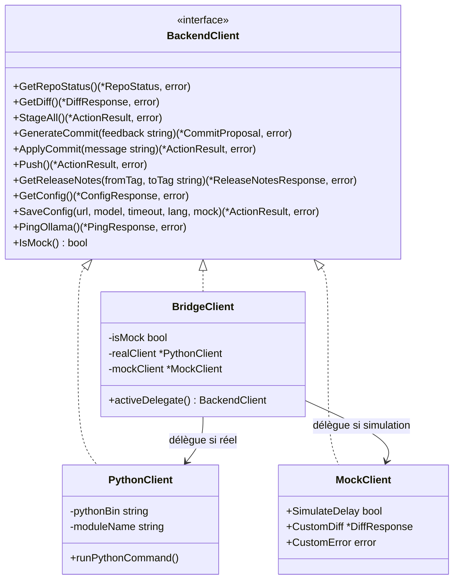

# Architecture et Fonctionnement de l'Interface CLI (Go)

## Guide Pratique : Compiler, Tester et Présenter

### Compiler le projet :
Dans un terminal, placez-vous dans le dossier `src/cli` :
```bash
cd SAE_sujet_8_application_intelligente/src/cli
go build -o git-generator main.go
```

### Options de la ligne de commande (Flags)

Le binaire propose trois options pour s'adapter à tous les contextes d'utilisation :

| Option | Valeur par défaut | Description |
|---|---|---|
| `--repo <chemin>` | `.` (répertoire courant) | **Dépôt Git cible à analyser** : chemin du projet sur lequel vous travaillez (pour extraire le `git diff`, générer un message de commit ou créer les release notes). |
| `--demo` | `false` | **Mode simulation autonome** : force le `MockClient` pour manipuler et tester l'interface TUI hors-ligne sans serveur Ollama ni sous-processus Python. |
| `--app-dir <chemin>` | Auto-détecté | **Racine de l'application Smart Commit** : chemin vers le dossier de notre outil (`SAE_sujet_8_application_intelligente`), où résident le fichier `.env` applicatif et le code Python. |

> [!NOTE]
> **Pourquoi séparer `--repo` et `--app-dir` ? (Isolation stricte)**  
> Dans une utilisation classique, l'outil analyse un projet externe (ex: `--repo ~/projets/mon-site`). La distinction garantit que :
> 1. Les réglages de notre application (URL Ollama, modèle, timeout, etc.) sont lus et modifiés **exclusivement** dans le `.env` de Smart Commit (`--app-dir`).
> 2. Le projet cible analysé (`--repo`) n'est **jamais parasité** par la création d'un `.env` applicatif.
> 
> Dans 99% des cas, `--app-dir` est **détecté automatiquement** par l'application (en inspectant le chemin du binaire ou du code source). Ce drapeau n'est utile que si vous installez `git-generator` dans un répertoire système global (ex. `/usr/local/bin`) et que vous l'exécutez depuis un tout autre dossier.

### Lancer l'application :
```bash
# 1. Lancement standard dans le dépôt courant (mode réel ou mock selon le .env) :
./git-generator

# 2. Lancement forcé en mode démo (autonome, sans backend Python requis) :
./git-generator --demo

# 3. Lancement en ciblant un autre dépôt Git :
./git-generator --repo /chemin/vers/un/autre/projet

# 4. Lancement avec indication explicite de la racine de l'application :
./git-generator --repo /chemin/vers/projet --app-dir /chemin/vers/SAE_sujet_8_application_intelligente
```

### Exécuter les tests unitaires Go :
Conformément à l'architecture du projet, tous les tests sont isolés dans le dossier `test/` :
```bash
cd test/cli
go test -v ./...
```

---


## Pourquoi avoir choisi Go pour le Front-end ?
* **Vitesse et instantanéité** : Go se compile directement en code machine natif. L'exécutable se lance en moins de 5 millisecondes, sans aucun temps de démarrage d'interpréteur (comme Python ou Node.js).
* **Binaire unique et autonome** : Aucun besoin d'installer de runtime Go sur la machine cible. Le binaire embarque tout.
* **Maîtrise complète du Terminal** : Possibilité de créer une interface TUI (Terminal User Interface) élégante, fluide et animée sans aucune bibliothèque tierce lourde.


## Comment Go communique avec Python (Le Pont / Bridge)

Toute la communication repose sur le paquet [`src/cli/bridge/`](file:///SAE_sujet_8_application_intelligente/src/cli/bridge/), structuré autour de l'interface Go idiomatique `BackendClient`.

### Le mécanisme d'appel système (`exec.Command`)
Go n'utilise pas de socket réseau ou de serveur HTTP local pour parler à Python (ce qui serait lourd et risquerait des conflits de ports).  
Go lance simplement Python en sous-processus système (implémenté dans `python_client.go`) :

```go
// Exemple simplifié de ce que fait Go sous le capot :
cmd := exec.Command("python3", "-m", "git_commit_release_notes_generator.service.core", "--action", "diff")
cmd.Dir = repoPath // S'exécute à la racine du dépôt

var stdout, stderr bytes.Buffer
cmd.Stdout = &stdout
cmd.Stderr = &stderr

err := cmd.Run()
```

### Le protocole JSON et la règle de `stdout` vs `stderr`
Pour que le pont fonctionne sans faille, nous avons fixé une règle universelle :
1. **`stdout` (Sortie Standard)** : Réservé **exclusivement** au JSON de données. Python ne doit JAMAIS faire de `print("chargement...")` sur `stdout`.
2. **`stderr` (Sortie d'Erreur)** : Utilisé pour les logs, les traces de débogage ou les messages d'avertissement de Python.

Dès que la commande Python se termine, Go désérialise le JSON brut reçu sur `stdout` directement dans une structure Go typée grâce à `json.Unmarshal` :

```go
var diffResp models.DiffResponse
err := json.Unmarshal(stdout.Bytes(), &diffResp)
// Maintenant, Go manipule des variables fortement typées : diffResp.Files, etc.
```

### Architecture du Mock & Inversion des Dépendances (DIP)

Afin de respecter les conventions Go (*"Accept interfaces, return structs"*) et le principe de responsabilité unique (SRP), le pont sépare strictement les contrats, les appels réels et la simulation :



#### Configuration via le fichier `.env` (`MOCK_INTERFACE`)
L'activation du mode démo / test est pilotée par la variable `MOCK_INTERFACE` dans le fichier `.env` ou par le drapeau `--demo` en ligne de commande :

```dotenv
# Dans le .env à la racine de l'application (et .env.exemple)
MOCK_INTERFACE=true   # -> Active le mode démo / test hors-ligne
MOCK_INTERFACE=false  # -> Mode standard : délègue au backend Python
```

Lorsque `MOCK_INTERFACE=false`, le client communique avec le sous-processus Python et remonte fidèlement les données ou erreurs réelles.

#### Implémentation du mode démo (`mock_client.go`)
Le `MockClient` implémente `BackendClient` en fournissant des réponses cohérentes avec les cas de test du projet (secrets masqués, détection binaire, latence de traitement).  
Pour les tests unitaires automatisés situés dans le dossier `test/` (`test/cli/bridge_test.go`), il permet de désactiver les délais (`SimulateDelay = false`) et de surcharger les retours ou erreurs (`CustomError`, `CustomDiff`).

#### La bascule dynamique sans recompilation
La fonction factory `NewBackendClientWithAppRoot(repoRoot, appRoot, forceDemo)` instancie le coordinateur `BridgeClient`.  
Lorsque l'utilisateur modifie la configuration depuis l'écran `[3]` de la CLI :
1. `SaveConfig` met à jour le fichier `.env` à la racine de l'application via le module dédié `env.go`.
2. Le `BridgeClient` bascule instantanément son délégué actif entre `MockClient` et `PythonClient` sans nécessiter **la moindre modification ni recompilation de code côté Go**.

---

## Architecture Interne du Code Go (`src/cli/`)

### Arborescence détaillée
```text
src/cli/
├── go.mod                     # Définition du module Go (go 1.22, 0 dépendance externe)
├── main.go                    # Point d'entrée, capture Ctrl+C, boucle du menu
├── models/
│   └── types.go               # Structs Go typées mappées sur les schémas JSON
├── bridge/
│   ├── client.go              # Interface BackendClient et coordinateur BridgeClient
│   ├── python_client.go       # Implémentation réelle (exec.Command & unmarshal JSON)
│   ├── mock_client.go         # Implémentation simulation / mock pour mode démo & tests
│   └── env.go                 # Gestionnaire autonome du fichier .env (lecture/écriture)
├── ui/
│   ├── styles.go              # Codes ANSI, TrueColor, calcul VisualLen, StripANSI
│   ├── box.go                 # Tracé des fenêtres, bordures Unicode, tableaux
│   └── spinner.go             # Goroutine de chargement dynamique avec chronomètre
└── views/
    ├── menu_view.go           # Écran 1 : Accueil et affichage du contexte dépôt
    ├── commit_view.go         # Écran 2 : Diff, validation, feedback LLM, git push
    ├── release_notes_view.go  # Écran 3 : Sélection tags et rendu Markdown
    └── config_view.go         # Écran 4 : Paramètres .env et test ping Ollama
```

### Rôle de chaque paquet :
* **`models`** : Ne contient aucune logique. Seulement les définitions de structures (`RepoStatus`, `DiffFile`, `CommitProposal`, `ConfigResponse`, etc.).
* **`bridge`** : Expose l'interface `BackendClient` et orchestre les communications avec Python ou le mock.
* **`ui`** : La boîte à outils graphique. Gère l'affichage à l'écran, les couleurs, les bordures et les animations.
* **`views`** : Contient les 4 écrans interactifs. Chaque vue prend en paramètre le `bufio.Reader`, l'interface `BackendClient` et le `RepoStatus`.


## Fonctionnement Écran par Écran

### Écran 1 : Menu Principal & Contexte Dépôt
* Dès l'ouverture, Go appelle `client.GetRepoStatus()`.
* Python lui répond en JSON :
  ```json
  { "is_git_repo": true, "branch": "interface-cli", "staged_count": 3, "unstaged_count": 1 }
  ```
* Go génère la bannière d'en-tête avec les pastilles de couleur :
  * Si `staged_count > 0` : affiché en vert.
  * Si `staged_count == 0` : affiché en jaune avec avertissement.
  * Indication discrète du mode uniquement si la simulation est active : `ℹ Mode simulation actif (MOCK_INTERFACE=true dans le .env)` (aucun message superflu en mode réel standard).
* L'utilisateur tape `1`, `2`, `3`, `4` ou `q` pour naviguer.

---

### Écran 2 : Génération de Commit & Boucle de Décision
C'est le cœur de l'outil :

1. **Vérification du diff** : Go demande les fichiers modifiés (`client.GetDiff()`).
2. **Auto-stage** : Si aucun fichier n'est indexé, Go demande :  
   `Voulez-vous indexer automatiquement toutes les modifications (git add -A) ? [O/n]`  
   Si oui, Go demande à Python d'exécuter l'ajout, puis réactualise le diff.
3. **Tableau visuel** : Affiche les fichiers modifiés :
   * `[M]` en cyan pour modifié.
   * `[A]` en vert pour ajouté.
   * `[D]` en rouge pour supprimé.
   * Badge spécial `🔒 [Secret Masqué]` si Dorian a détecté une clé API ou un token dans le patch.
   * Badge `[Binaire]` pour les images ou exécutables exclus.
4. **Appel IA** : Le spinner tourne pendant que le modèle `gemma4:12b` réfléchit.
5. **Carte Conventional Commits** : Affichage encadré du résultat structuré :
   * `Type` (`feat`, `fix`, `docs`, etc.)
   * `Scope` (`auth`, `cli`, etc.)
   * `Subject` (la phrase de commit)
   * `Body` (explications complémentaires)
6. **Boucle d'actions** :
   * **`[V] Valider`** : Go demande à Python d'appliquer le commit (`client.ApplyCommit`). Python exécute `git commit` et renvoie le SHA (ex: `7a9e2f4`). Go demande ensuite si l'utilisateur souhaite faire un `git push`.
   * **`[R] Régénérer avec consigne`** : Go demande un texte à l'utilisateur (ex: *"Sois plus concis"* ou *"C'est plutôt un fix"*). Go renvoie ce feedback à Python pour réinterroger le LLM.
   * **`[M] Modifier manuellement`** : Permet de retaper directement le sujet ou le body dans la console avant de valider.
   * **`[A] Annuler`** : Revient au menu sans rien toucher.

---

### Écran 3 : Génération des Release Notes
1. Go demande à l'utilisateur :
   * Le tag de départ (par défaut `v0.1.0`).
   * Le tag d'arrivée (par défaut `HEAD`).
2. Python extrait les commits entre ces deux bornes et demande au LLM de rédiger un changelog structuré.
3. Go affiche le document Markdown dans une boîte dédiée.
4. L'utilisateur peut appuyer sur `[S]` pour enregistrer automatiquement le résultat dans un fichier `RELEASE_NOTES.md` à la racine du dépôt.

---

### Écran 4 : Configuration (.env) & Diagnostic Ping Ollama
Cet écran répond directement aux **consignes impératives de contrôle de l'IUT** :
* Affiche les variables lues par Python et Go :
  * `OLLAMA_BASE_URL` (par défaut `http://10.22.28.190:11434`)
  * `OLLAMA_MODEL` (par défaut `gemma4:12b`)
  * `OLLAMA_TIMEOUT_S` (60s)
  * `APP_LANGUAGE` (fr)
  * `MOCK_INTERFACE` (true / false)
* **Action `[T]` (Test Ping)** : Go demande à Python d'effectuer une requête rapide vers le serveur Ollama. S'il répond, l'écran affiche en vert la latence en millisecondes et la liste réelle des modèles installés sur le serveur !
* **Action `[M]` (Modification)** : Permet de modifier l'adresse IP, le modèle, le timeout ou d'activer/désactiver le mode démo (`true`/`false`). Go sauvegarde immédiatement les valeurs dans le fichier `.env`.  
   👉 **Aucune recompilation du binaire Go n'est nécessaire.**

